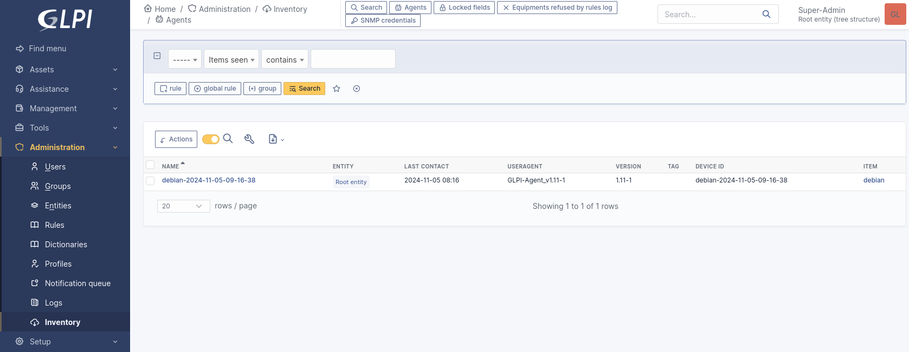
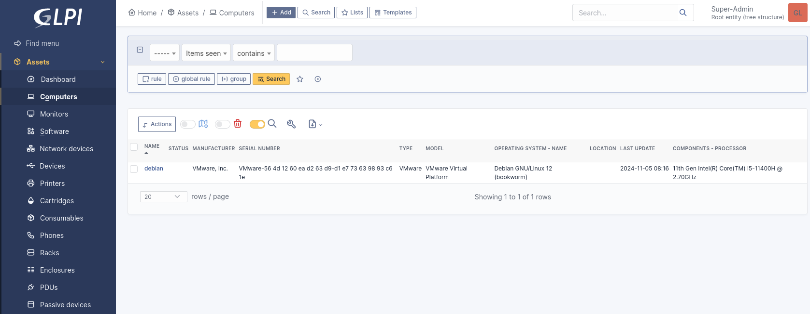

# GLPI Agent

## Prerequisites

A GLPI server. See [`glpi`](../glpi) for installation and configuration.

The following package is required on *managed nodes*:
- `sudo`

## Deployment preparation

Create a SSH key `ansible` to allow SSH connections to the devices:

```bash
ssh-keygen -t ecdsa -b 521 -f ~/.ssh/ansible
```

Copy the SSH key to the devices where the GLPI agent will be deployed:

```bash
ssh-copy-id -i ~/.ssh/ansible.pub <username-1>@<remote-host-1>
```

**⚠️ Complete the `<username-x>` and `<remote-host-x>` fields. Also, `<username-x>` must belong to the `sudo` group. ⚠️**

## Ansible playbook

The Ansible playbook `install-glpi-agent.yml` has two variables to configure:

- the **version** of the GLPI agent
- the **URL** of the GLPI server

This Ansible playbook performs the following tasks:
- Install `curl` and `perl` packages
- Download the GLPI agent installation script
- Set execution permissions on the installation script
    - permissions `0755` : execution by the owner
- Run the GLPI agent installation script
    - no SSL certificate check due to self-signing. Remove the `--no-ssl-check` option if not needed
- Start and enable the GLPI agent

`install-glpi-agent.yml`:

```yml
---
- name: Install and configure the GLPI agent
  hosts: all

  vars:
    glpi_agent_version: "1.11"
    glpi_server_url: "https://<domain-name>"

  tasks:
    - name: Ensure required packages are installed (curl and perl)
      become: true
      package:
        name:
          - curl
          - perl
        state: present

    - name: Download the GLPI agent installation script
      command: "curl -L -o /tmp/glpi-agent-{{ glpi_agent_version }}-linux-installer.pl https://github.com/glpi-project/glpi-agent/releases/download/{{ glpi_agent_version }}/glpi-agent-{{ glpi_agent_version }}-linux-installer.pl"

    - name: Set execution permissions on the installation script
      file:
        path: "/tmp/glpi-agent-{{ glpi_agent_version }}-linux-installer.pl"
        mode: "0755"

    - name: Run the GLPI agent installation script
      become: true
      command: "perl /tmp/glpi-agent-{{ glpi_agent_version }}-linux-installer.pl -s {{ glpi_server_url }}/front/inventory.php --no-ssl-check --runnow --install --verbose"

    - name: Start and enable the GLPI agent
      become: true
      systemd:
        name: glpi-agent
        enabled: true
        state: started
```

**⚠️ Complete the `<domain-name>` field. ⚠️**

---

`inventory.ini` lists the devices where the GLPI agent will be deployed:

```ini
[glpi_agents]
<alias-1> ansible_host=<hostname-1> ansible_user=<username-1> ansible_ssh_private_key_file=~/.ssh/ansible
<alias-2> ansible_host=<hostname-2> ansible_user=<username-2> ansible_ssh_private_key_file=~/.ssh/ansible
```

**⚠️ Complete the `<alias-x>`, `<hostname-x>`, and `<username-x>` fields. ⚠️**

## Deployment

To deploy the GLPI agent, run the following Ansible playbook:

```bash
ansible-playbook -i inventory.ini install-glpi-agent.yml --ask-become-pass -v
```

- `--ask-become-pass` : requests for `<username-x>` password to obtain super-user privileges
- `-v` : verbose mode

On the GLPI server, after running the playbook, you should see your GLPI agent(s) deployed on your device(s) by accessing the "**Administration**" > "**Inventory**" > "**Agents**" menu:



You should also see the data for the device by accessing the "**Assets**" > "**Computers**" menu:


