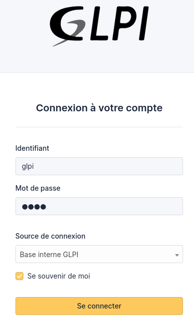
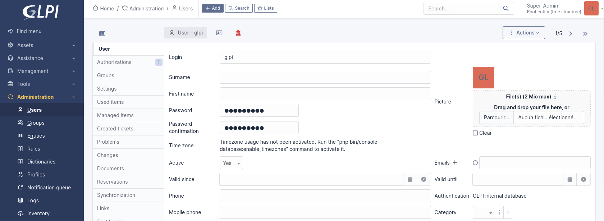
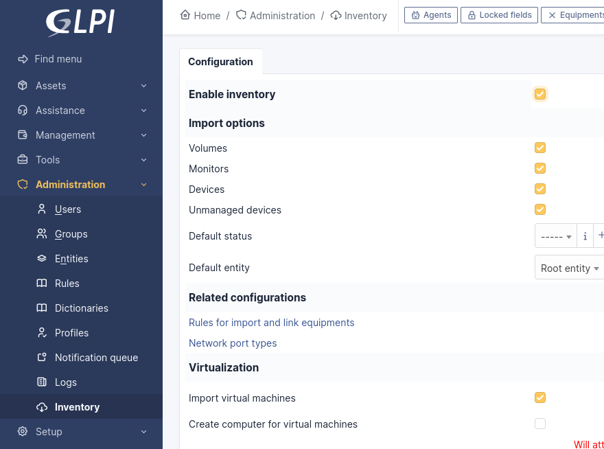
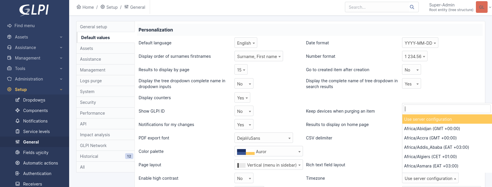
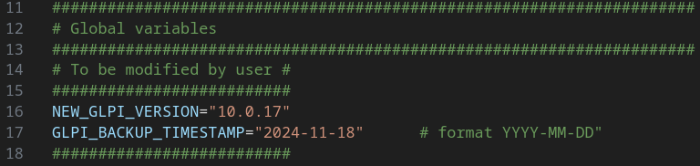

# GLPI | Configuration Guide

## First Login

Log in with the administrator account `glpi/glpi` :



### Security Warnings

Upon accessing the admin interface, you will see a security warning recommending you change the passwords for the `glpi`, `post-only`, `tech` and `normal` accounts :


In this example, we will change the password for the `glpi` account. To do so, go to the “**Administration**” > “**Users**”. Then, click on the user whose password needs to be changed, fill in the following fields, and click the “**Save**” button to apply the changes :



Repeat this process for the `post-only`, `tech` and `normal` accounts.

The second security warning indicates that the `install/install.php` file is present and should be removed :


To remove it, rerun the following script :

```bash
sudo ./deploy.sh
```

## Activate the inventory

When a GLPI agent is added to a device, the device will be added to GLPI automatically.

To do this, go to the "**Administration**" > "**Inventory**" menu. Then tick the "**Enable inventory**" box. Click on the "**Save**" button to apply the changes :



## Enable timezones

By default, dates are in UTC format. You must manually activate the option to have several timezones.


To enable timezones in GLPI, run the following script **from the `glpi` directory** :

```bash
sudo ./scripts/enable-timezones.sh
```

You can now change the timezone by going to the "**Setup**" > "**General**" > "**Default values**" menu :



## Backup

To backup the MariaDB database as well as GLPI data, run the following script **from the GLPI directory** :

```bash
sudo ./scripts/backup.sh
```

After running the script, in the `backups/` directory, you will find :

- `db-backup-YYYY-MM-DD.sql` : backup file of the MariaDB database
- `glpi-backup-YYYY-DD-MM` : directory containing the backup of GLPI data (`config/`, `files/`, `marketplace/` and `plugins/` directories)

```bash
.
├── db-backup-YYYY-MM-DD.sql
└── glpi-backup-YYYY-DD-MM
```

## Update

Example : upgrade from version **`10.0.16`** to **`10.0.17`**.

⚠️ In the Bash script `update.sh`, replace the variables below with the new version of GLPI (`NEW_GLPI_VERSION`) and the date of the last backup of GLPI data in the directory `backups/` (`GLPI_BACKUP_TIMESTAMP`) ⚠️ :



To update GLPI, run the following script **from the `glpi` directory** :

```sh
sudo ./scripts/update.sh
```

GLPI should now be upgraded.