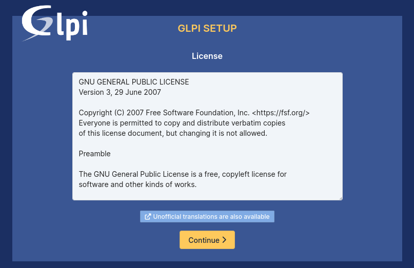
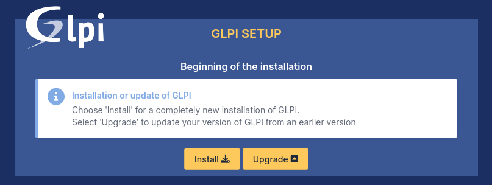
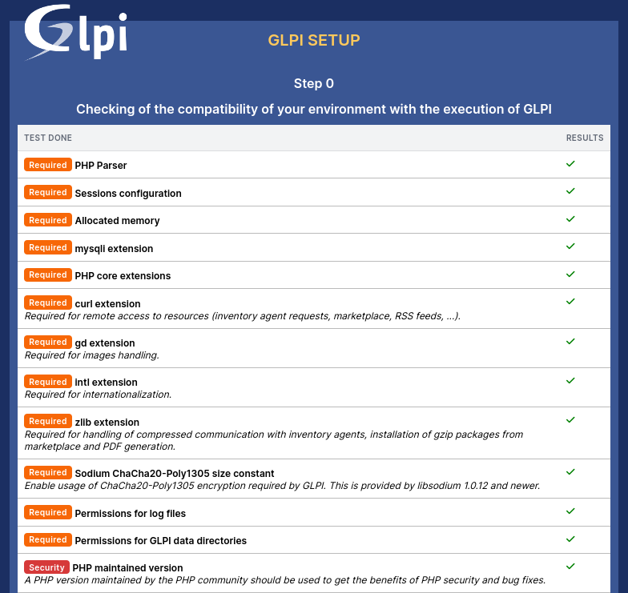
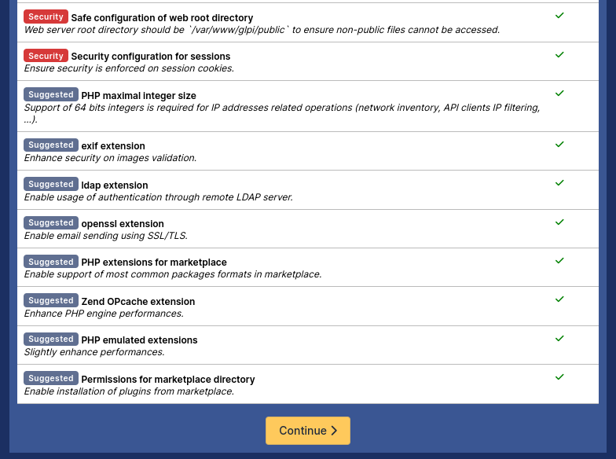
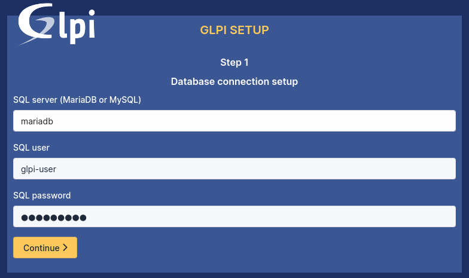
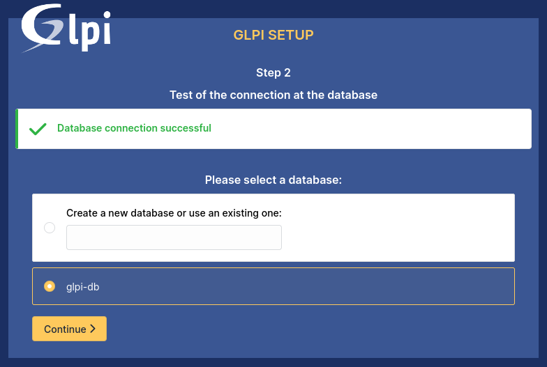
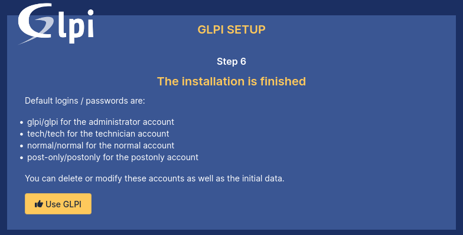

# GLPI | Installation Guide

Choose your language and click the “**OK**” button :

Please accept the license agreement by clicking the “**Continue**” button :

Click the “**Install**” button :

You should see a fully compatible environment for the installation and execution of GLPI. Click the “**Continue**” button :

Set up the connection to the MariaDB database by entering the credentials from the `MARIADB_USER` and `MARIADB_PASSWORD` fields in `secrets.env`, then click the “**Continue**” button :

Select the MariaDB database specified in `secrets.env` (`glpi-db`) to initialize the database :

Finally, here is the last screen indicating the installation is complete. Click “**Use GLPI**” to proceed with the configuration of the tool :

## Configuration 

Please refer to the [configuration guide](CONFIG.md).